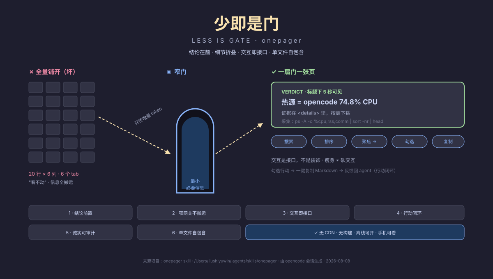

# onepager

> **少即是门** · Less is Gate
> 结论在前，细节折叠，交互即接口。



**Onepager** 是给 AI agent 的「窄门哲学」技能：当你要交付交互式 HTML 报告 / dashboard / 诊断页 / explainer / 计划页时，它保证产物不是信息全铺开的静态长文，而是一扇扇窄门——每次交互只交换**最小必要信息**，让人与 agent 高效协作。

## 为什么叫 onepager

交付物始终是**一个**单文件 HTML：结论一屏可见、细节按需展开、交互全部保留、离线可开、手机可看。它不绑架用户环境，也不搬运全量上下文。

## 核心法则

1. **结论前置** — 标题下 5 秒内出现一句可行动的结论（TL;DR），证据按需下钻。人不该读完报告才知道结论。
2. **窄网关，不搬运** — 每个交互都是一扇窄门：搜索只返回匹配行、聚焦只传一个 pane_id、勾选只回传增量状态。绝不全量铺开。
3. **交互是接口，不是装饰** — 瘦身可以砍内容，**绝不砍交互**。搜索 / 排序 / 聚焦 / 勾选 / 复制 是窄网关本身，砍掉 = 砍掉人↔agent 的协作通道。这是最常见的翻车点。
4. **行动闭环** — 诊断必须带「行动」：可勾选、有进度、可一键复制为 Markdown，把决策状态反馈回 agent。
5. **诚实可审计** — 标注采集命令 / 时间戳 / 来源；没问题就说没问题（"机器散热健康"），瞬时尖峰标注"非持续"。可复现才值得信任。
6. **单文件自包含** — 无 CDN、无构建步骤、离线可用、手机可看。

## 触发时机

- 用户要「交互式 HTML / 诊断报告 / dashboard / 计划页 / explainer」
- 用户要瘦身 / 重构一份臃肿的报告（此时默认走"保交互砍内容"路线）
- 用户提到 窄门 / small interface / 最小必要信息
- 刚产出的全量报告被用户否掉（"信息太多" / "失去交互"）——立刻用本法则重做

## 目录结构

```
onepager/
├── SKILL.md                 # 主 skill：法则 + 工作流 + 检查清单 + 反模式
├── evals/
│   └── evals.json           # 评测用例（Mac 发热诊断 / 臃肿验收报告瘦身）
├── scripts/
│   └── focus-server.cjs     # 可选：loopback 聚焦服务，把 HTML 条目连到真实窗口
└── README.md
```

## 安装

```bash
# Claude Code / agent 环境：放到 skills 根目录
cp -r onepager ~/.claude/skills/
# 或 ~/.agents/skills/
```

## 评测

自带 2 个评测用例（`evals/evals.json`），配套 [skill-creator](https://github.com/vercel-labs/skill-creator) 生态的 `generate_review.py` 生成 eval viewer；workspace 反例教材 `anti-patterns/` 用于对照教学。

## 反模式（血泪教训）

- ❌ 把报告"瘦身"成静态文本 → 砍掉了窄网关，用户会回"我们失去了交互能力"
- ❌ 全量表格默认平铺 20 行 × 6 列 → 搬运上下文
- ❌ 为了显得有用夸大结论（"机器快坏了！"）→ 毁信任
- ❌ 交互做装饰不做接口（动画很多，却没法聚焦真实窗口 / 复制结果）

## License

MIT
